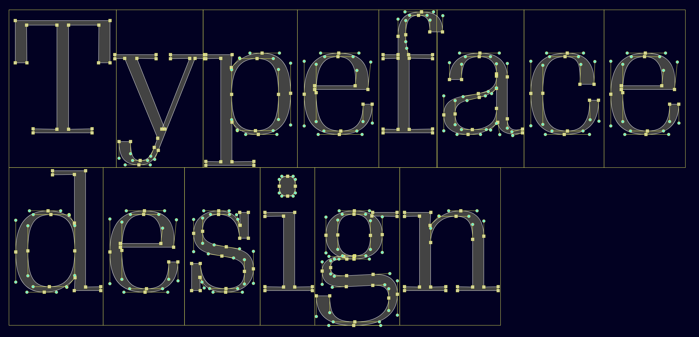

# Creative Type Design

* CDGD-416-04 Ap1
* Fall 2026

## Instructor Information

* Name: [David Jonathan Ross](https://djr.com)
* E-mail: [david@djr.com](mailto:david@djr.com)
* Office Hours: [Calendly](https://calendly.com/djrrb/meeting)

## Course Description

In this course, students will create their own typeface. Along the way, they will learn the fundamentals of letterform design and encounter a variety of approaches to developing a system of shapes that must at once be unique and yet always work together to form attractive and readable text. Working with font design software, students will also become more familiar than they want to be with the technical aspects of font formats and Bézier curves, and will learn how new advancements like variable fonts are just the latest step in an evolution of technologies that have influenced the shapes that we read. Emphasis will be placed on text and display typography for the Latin script, but students will be encouraged to engage with different historical models and consider the impact of the typefaces they create in a broader cultural context.

## Outcomes & Goals
Upon completion of this course, you will:

* Design an original typeface
* Draw letters in a variety of styles with a variety of techniques for a variety of applications
* Have a deeper understanding of typography, and the critical decisions that go into making and using a typeface
* Be able to comfortably draw with Bézier curves
* Have a working knowledge of font design software
* Have a working knowledge of the techincal issues surrounding making and using fonts

## Course Expectations

I expect you to attended classes regularly, participate in critiques and discussions, and complete exercises and readings. You'll need to work independently on your typeface projects both inside and outside of class, and present your progress at various points throughout the semester. You will be working on new projects in new software, and will have to be resourceful in finding solutions to problems you encounter or ways to work around them. And if you find yourself having trouble with the course material, or will need to miss a session, I expect you to get in touch with me either by e-mail or before/after class.

Your portfolio typeface project is largely self-directed, and will be different for each student. You'll propose a concept, intended use, and basic control characters, and then use this specification to guide your decisionmaking throughout the semester.

## Course Materials

* [Glyphs](https://glyphsapp.com), for typeface design
* [Zoom](https://zoom.us), for class meetings
* [Discord](https://discord.com), for asynchronous correspondence
* [GitHub](https://github.com), for supplemental materials
* [InDesign](https://www.adobe.com/products/indesign.html) (or similar), for layout and proofing
* Pen, pencil, and paper
* Laser printer, if possible

## Itinerary

### Session 1: Sept 15
* Course Introduction
* GlyphsApp Introduction
* Work on pixel project
* Bézier curves demo

### Session 2: Sept 29
* Work on portfolio project proposal
* Control characters
* Spacing

### Session 3: Oct 13
* Parametric design
* Designing for specific uses
* Proofing

### Session 4: Oct 27
* **Midterm review**
* Type, writing systems, and language
* Calligraphy, tools, and markmaking

### Session 5: Nov 10
* Font families and variable fonts
* OpenType features, alternates, and ligatures

### Session 6: Nov 24
* Font licensing and the type industry
* Kerning

### Session 7: Dec 8
* **Final crit**
* Guest speaker?

### Other dates
 * Dec 18: **All course materials due**
 * Jan 2: **Final grades due**

# MassArt Policy

## Course Attendance

Students have a responsibility to attend all scheduled class meetings.

Faculty are responsible for clearly stating their expectations for performance and attendance through the course syllabus, and during the first week of classes. This includes their manner of recording attendance and whether any portion of a student's grade is based on attendance and/or class participation. Faculty are obligated to recognize legally protected activities, such as religious holidays, military service, and jury duty.

Students are responsible for making themselves aware of course attendance policies, and for meeting all course expectations as outlined in the course syllabus regardless of missed class time. Students are responsible to communicate in a timely manner in written form (e.g. in an email) with their faculty regarding any missed class time and related class work. 

A student who feels circumstances may warrant withdrawal from a single course should contact their Advisor and the Office of the Registrar. A student who wishes to request a medical leave of absence from the College should contact the Counseling and Wellness Center. Non-medical leaves of absence are coordinated through the Academic Resource Center.

A student who misses the first meeting of a class may be dropped from the roster by the instructor.

## The Academic Resource Center

The Academic Resource Center (ARC) provides access for all matriculated MassArt students to academic Advisors, success coaches, writing specialists, and a "Success Squad" of peer tutors and peer advisors, all of whom support remote and hybrid learning. Specific ways the ARC can support students include: 

* Skills for successful remote learning
* Writing assistance on papers, artist statements, and assignments
* Time Management
* Advising on major selection and course plans
* Reading strategies
* Test preparation and strategies 

Appointments can be made at [massart.edu/arc-appt](https://massart.edu/arc-appt). Learn more about the ARC at [massart.edu/academic-resource-center](https://massart.edu/academic-resource-center).

## Students with Disabilities

Massachusetts College of Art and Design is committed to fostering the academic, personal, and professional growth of our students. We are especially committed to ensuring that students with documented disabilities, as defined under the Americans with Disabilities Act (ADA) and the subsequent Amendments Act (ADAAA), are provided equal access to all campus resources and opportunities.  If you have a disability that may warrant accommodations, I encourage you to make an appointment with Student Accessibility Services staff within the Academic Resource Center (ARC) at [massart.edu/arc-appt](https://massart.edu/arc-appt). For more information, please visit the Student Accessibility Services web page: [https://massart.edu/student-accessibility-services](https://massart.edu/student-accessibility-services). 

The Academic Resource Center is where all matriculated MassArt students have access to academic advisors, success coaches, writing specialists and a “Success Squad” of peer tutors and peer advisors, all of whom support remote and hybrid learning. Appointments can be made at [massart.edu/arc-appt](https://massart.edu/arc-appt). Learn more about the ARC at [massart.edu/academic-resource-center](https://massart.edu/academic-resource-center).

## Media Recording

This class may use video and audio recordings of faculty and students, both online and in person, to better support learning in a blended format. By enrolling in the course, students are consenting to being recorded in this class and may only withdraw such consent by informing the course instructor in writing. As these recordings may contain intellectual property as well as confidential student information (ex. student names, likenesses), sharing or transferring recordings of such content by any method currently available or any method that may become available in the future is not allowed and copies of such recordings should not be provided to others; uploaded, linked, embedded, or otherwise posted via file-sharing, social media, or other sites or services which could enable anyone to view or hear them who is not currently enrolled in the course; or share them in any other way. Access to video and audio recordings in this class is for personal educational use only and is available only to individuals currently enrolled in the class, unless faculty permission is expressly granted. Recording and/or sharing course materials including video and audio files without the written consent of the course instructor is a violation of College policies (ex. academic honesty) and will be reported to the Registrar and/or Dean of Students for further action and/or discipline.

## Grading System

[Here’s the department’s grading policy](https://drive.google.com/file/d/1mFEPZr0tELEE5kNRGH_5rVCfDLVZBY6Y/view?usp=drive_link)

## Plagiarism

In creative work, plagiarism is the inappropriate and unethical representation of another’s work as one’s own.  In those instances where a significant portion of a creative work is intentionally “appropriated,” plagiarism is the failure to note, orally or in writing, the source of the appropriation. In expository or academic writing, whenever your work incorporates someone else’s research, images, words, or ideas, you must properly identify the source unless you can reasonably expect knowledgeable people to recognize it. Proper citation gives credit where it is due and enables your readers to locate sources and pursue line of inquiry raised by your paper. Students who do not comply may be penalized.